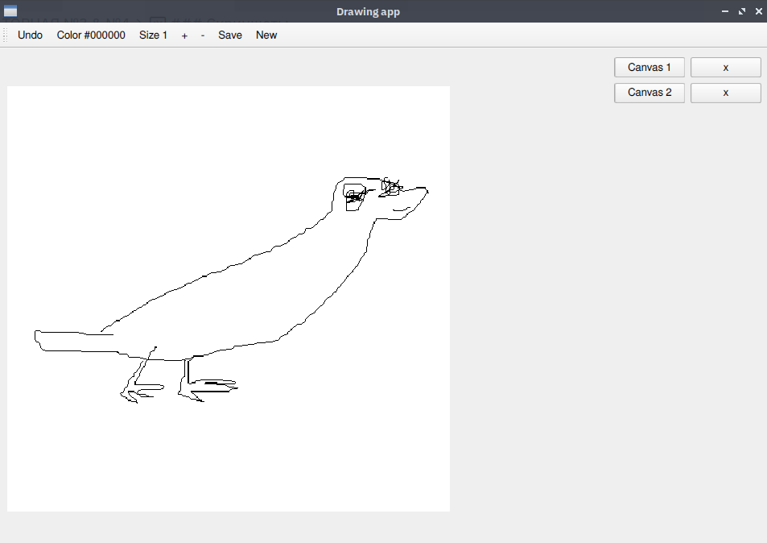
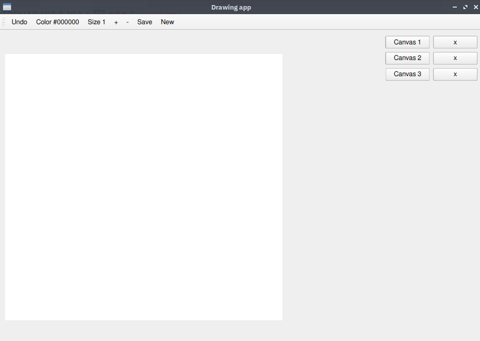
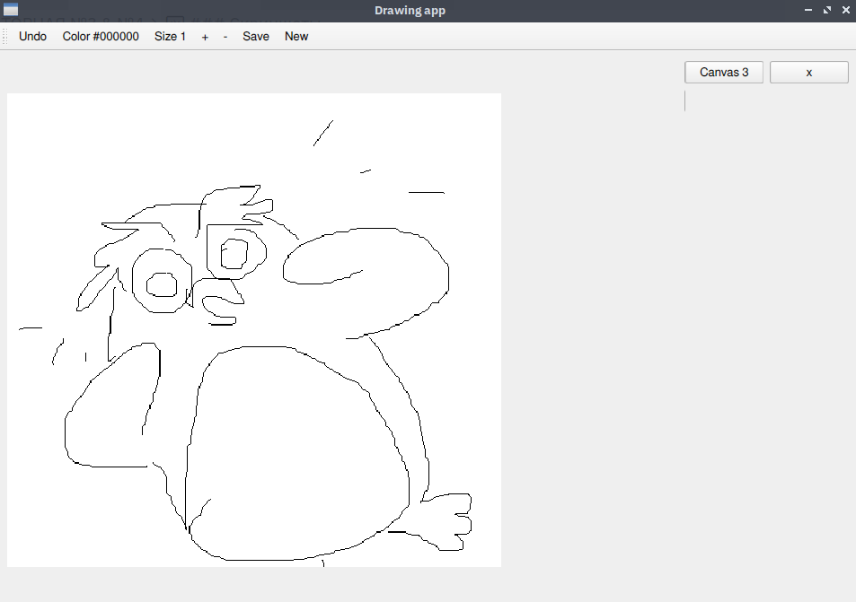

## ЛАБОРАТОРНАЯ №3 & №4
### Задача
Реализовать паттерн "Хранитель/Мементо" в программе.
Реализовать паттерн "Преобразователь/Маппер" в программе.
### Описание программы
Приложение для рисования. Функции:
- менять цвет и размер карандаша
- стирать (зажимая ПКМ)
- возвращать предыдущее состояние (кнопка 'undo'), хранятся последние 20 состояний
- создавать несколько холстов и переключаться между ними
### Актуальность паттернов
##### Хранитель
Паттерн "Хранитель" используется для сохранения состояний экземпляра класса, в данном случае, холста. Создан дополнительный класс Memento, с которым клиент не может взаимодействовать напрямую. Когда клиент рисует на холсте, предыдущие состояния холста сохраняются как экземпляры Memento, и хранятся во втором вспомогательном классе Caretaker. При запросе клиента Caretaker возвращает самое недавнее состояние, и холст может восстановиться в него.
##### Преобразователь
Паттерн "Преобразователь" используется для работы с объектами хранящимися в базе данных. В данном случае, в базе хранятся холсты, создан класс Database который позволяет выполнять полный CRUD над ними.
### Скриншоты

